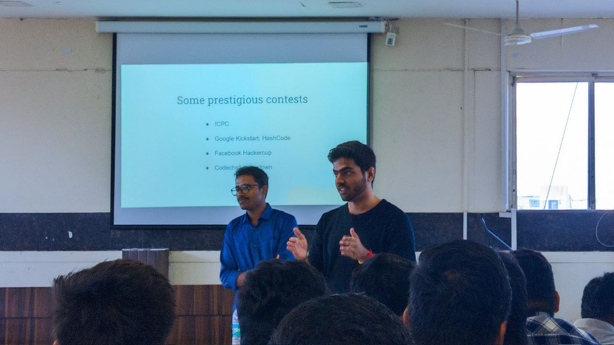
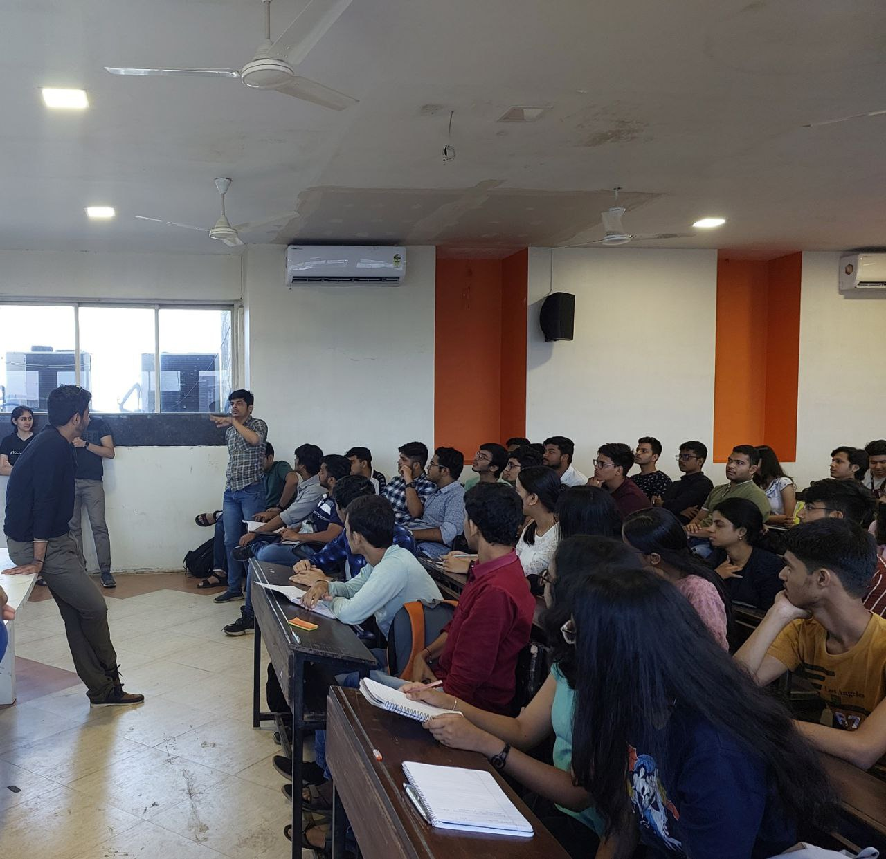
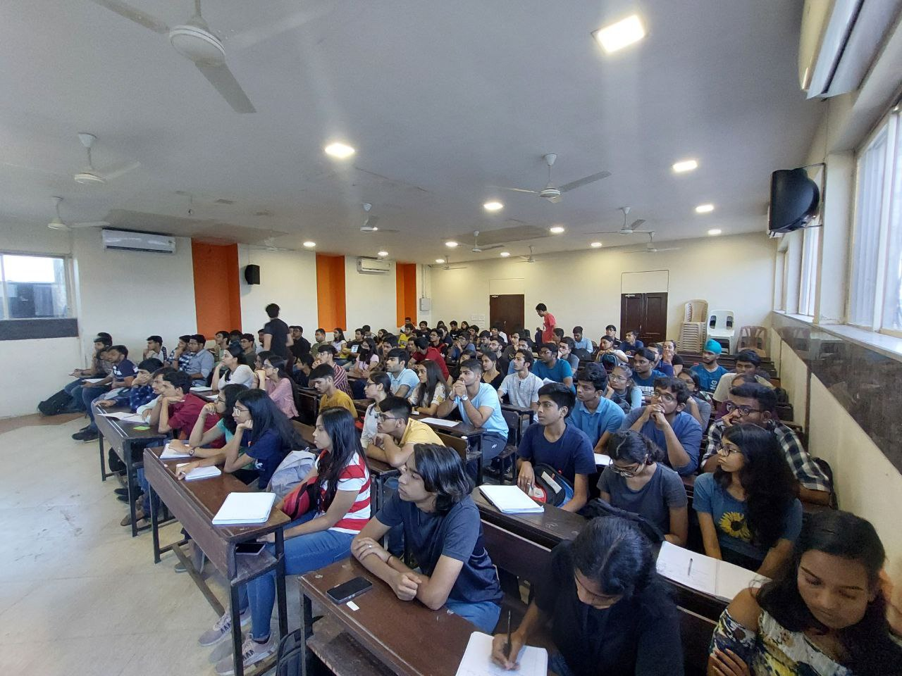
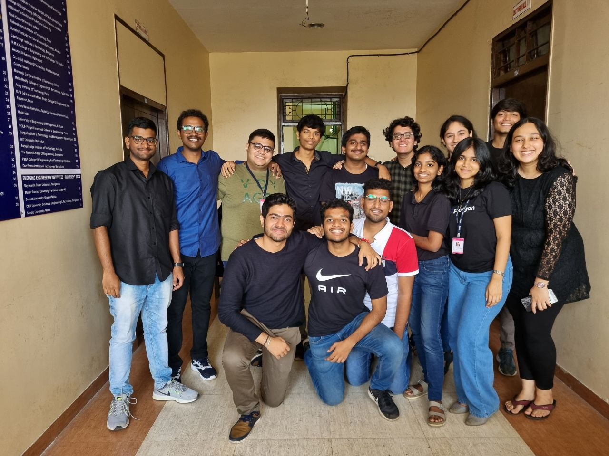

# Competitive Programming

- Long Talk (60 to 90 minutes)
- Covers broad overview of DSA, CP and Development.
- Generally, for the folks who are starting out.
- [Slides](https://docs.google.com/presentation/d/1kfPN_JOcz6Zh7iGKVEtIID4avnR2HEmgMmFSxesTFi4/edit?usp=drivesdk)
- [Talk Content](content.md)

## Timeline

- [Dive into Code](https://twitter.com/tusharnankanii/status/1560636588157046790) for [TSEC CodeCell](https://www.tseccodecell.com).
    - Offline talk
    - 27th August, 2022

<table>
    <tr>
        <td>
            
        </td>
        <td>
            
        </td>
    </tr>
    <tr>
        <td>
            
        </td>
        <td>
            
        </td>
    </tr>
</table>
