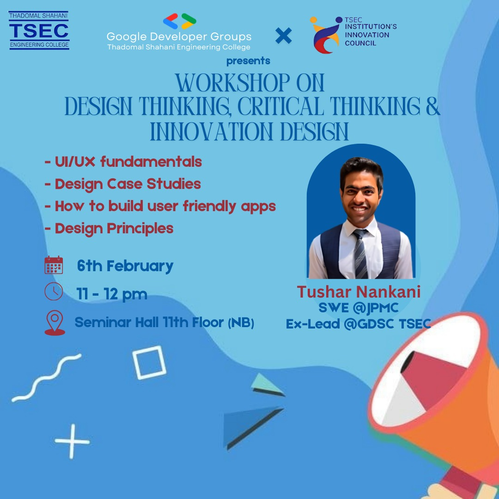
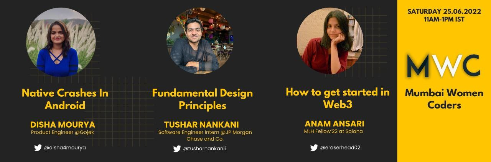
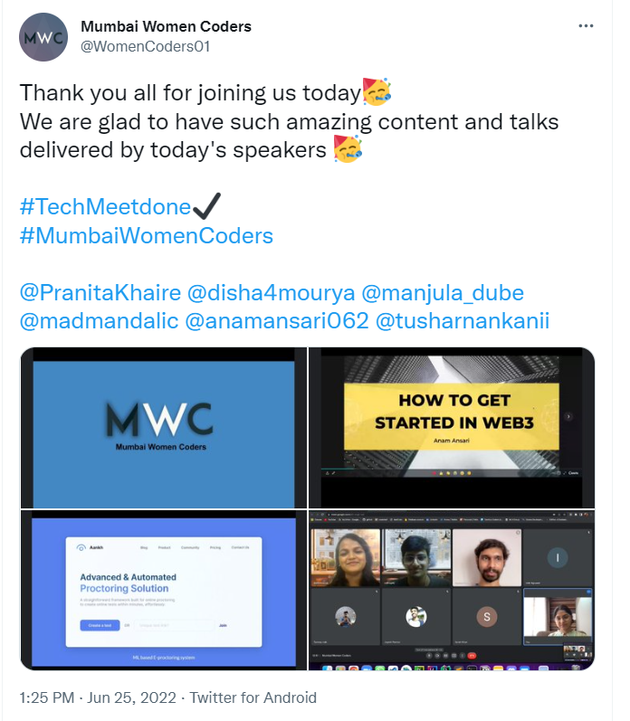
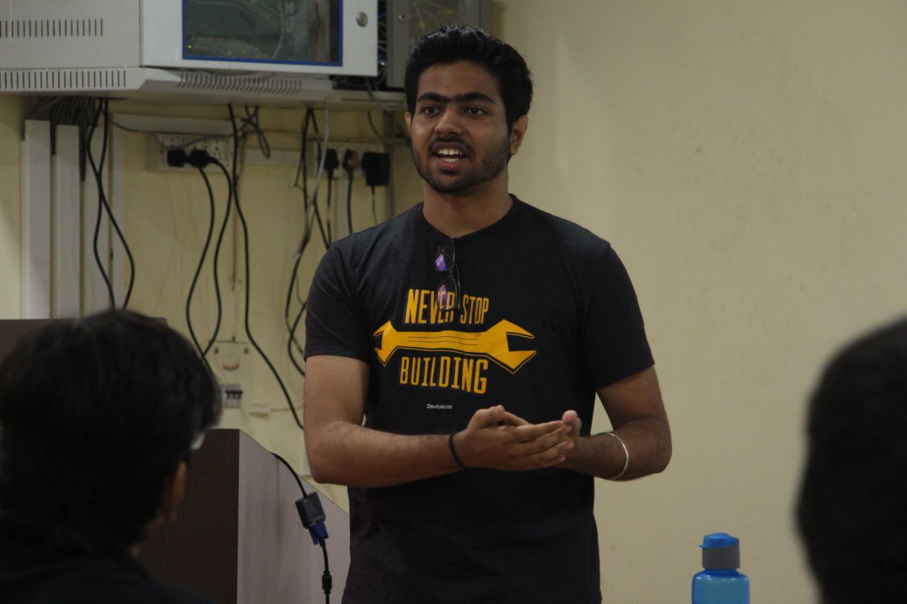
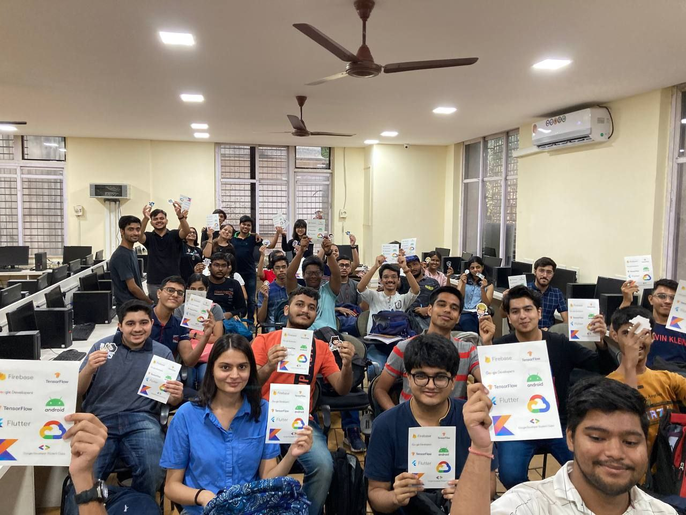
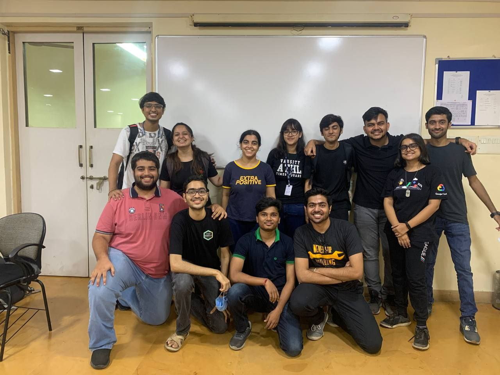

# Design Principles

- Lightning Talk (20 to 30 minutes)
- Covers broad overview of designing principles.
- [Slides](https://docs.google.com/presentation/d/1BQpoIQs8dlhTNrTo8rrb2AIWmflldezjTGM5ZBfNO_0/edit?usp=sharing)
- [Talk Content](content.md)

## Timeline

 - [Fundamental Design Principles](https://twitter.com/WomenCoders01/status/1535887218803453952) for [GDG TSEC](https://gdg.community.dev/gdg-on-campus-thadomal-shahani-engineering-college-mumbai-india/)
    - In-person
    - 6th February, 2025

<table>
    <tr>
        <td>
            
        </td>
        <td>
            
        </td>
    </tr>
</table>

- [Fundamental Design Principles](https://twitter.com/WomenCoders01/status/1535887218803453952) for [Mumbai Women Coders](https://www.meetup.com/mumbai-women-coders)'s [June Meetup](https://www.meetup.com/mumbai-women-coders/events/286422185)
    - Online talk
    - 25th June, 2022

<table>
    <tr>
        <td>
            
        </td>
        <td>
            
        </td>
    </tr>
</table>

- [Lightning Talk on Fundamental Design Principles](https://twitter.com/tusharnankanii/status/1523196762911293440) for [GDSC TSEC](https://gdsc.community.dev/thadomal-shahani-engineering-college-mumbai)'s [UXplore](https://twitter.com/tusharnankanii/status/1521406418481524737)
    - Offline talk
    - 7th May, 2022

<table>
    <tr>
        <td>
            
        </td>
        <td>
            
        </td>
    </tr>
    <tr>
        <td>
            
        </td>
        <td>
            
        </td>
    </tr>
</table>
