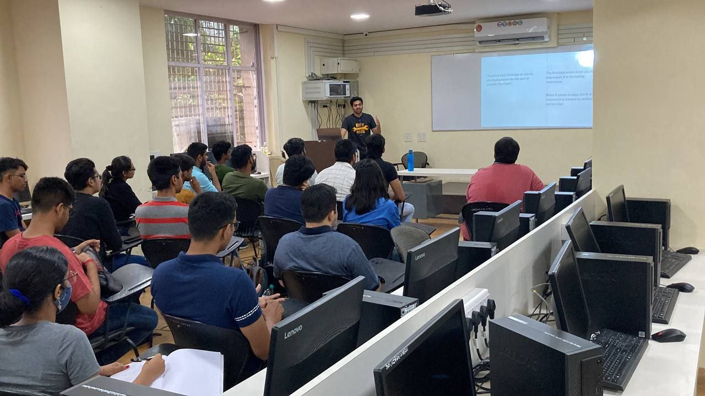

# Design Principles

- Lightning Talk (20 to 30 minutes)
- Covers broad overview of designing principles.
- [Slides](https://docs.google.com/presentation/d/1BQpoIQs8dlhTNrTo8rrb2AIWmflldezjTGM5ZBfNO_0/edit?usp=sharing)
- [Talk Content](content.md)

## Timeline

- Offline talk
  - [Lightning Talk on Fundamental Design Principles](https://twitter.com/tusharnankanii/status/1523196762911293440) for [GDSC TSEC](https://gdsc.community.dev/thadomal-shahani-engineering-college-mumbai)'s [UXplore](https://twitter.com/tusharnankanii/status/1521406418481524737?s=20&t=JLUmph-UwQYXKA9NveR6BQ) (7th May, 2022)

<table>
    <tr>
        <td>
            
        </td>
        <td>
            
        </td>
    </tr>
    <tr>
        <td>
            
        </td>
        <td>
            
        </td>
    </tr>
</table>
