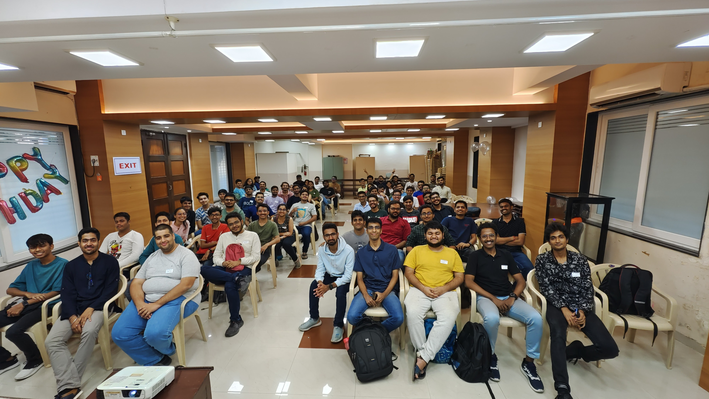

# Organizational Culture

<table>
    <tr>
        <td>
            
        </td>
        <td>
            
        </td>
    </tr>
</table>

- Lightning Talk (10 to 15 minutes)
- My perspectives, examples and opinions on cultures in organizations.
- [Slides](https://docs.google.com/presentation/d/1-a0FCI-z8pTrmHRq363KG9bxhkuf4zDDr_suuTQe2gg)
- [Talk Content](content.md)

## Timeline
 
- [Organizational Culture](https://twitter.com/OurTechComm/status/1578421450037264385) for [Our Tech Community](http://ourtech.community)'s [MeetUp #2](https://meetup.ourtech.community/2)
    - Offline talk
    - 9th October, 2022

<table>
    <tr>
        <td>
            
        </td>
        <td>
            
        </td>
    </tr>
    <tr>
        <td>
            
        </td>
        <td>
            
        </td>
    </tr>
</table>